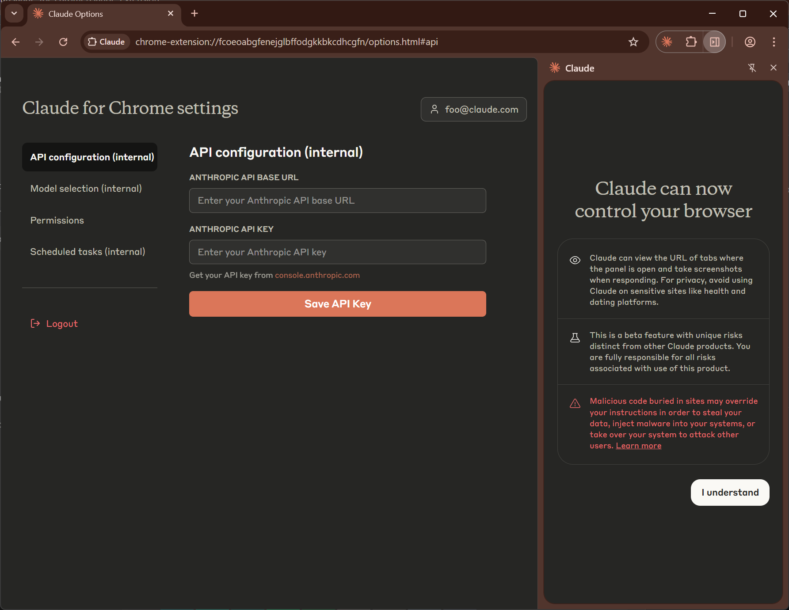
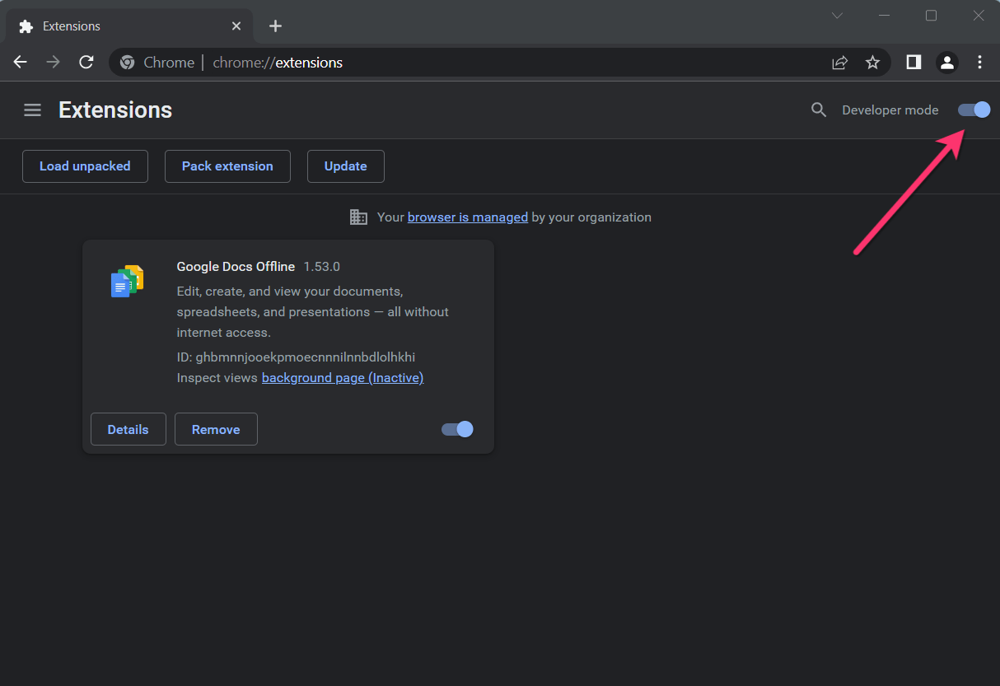
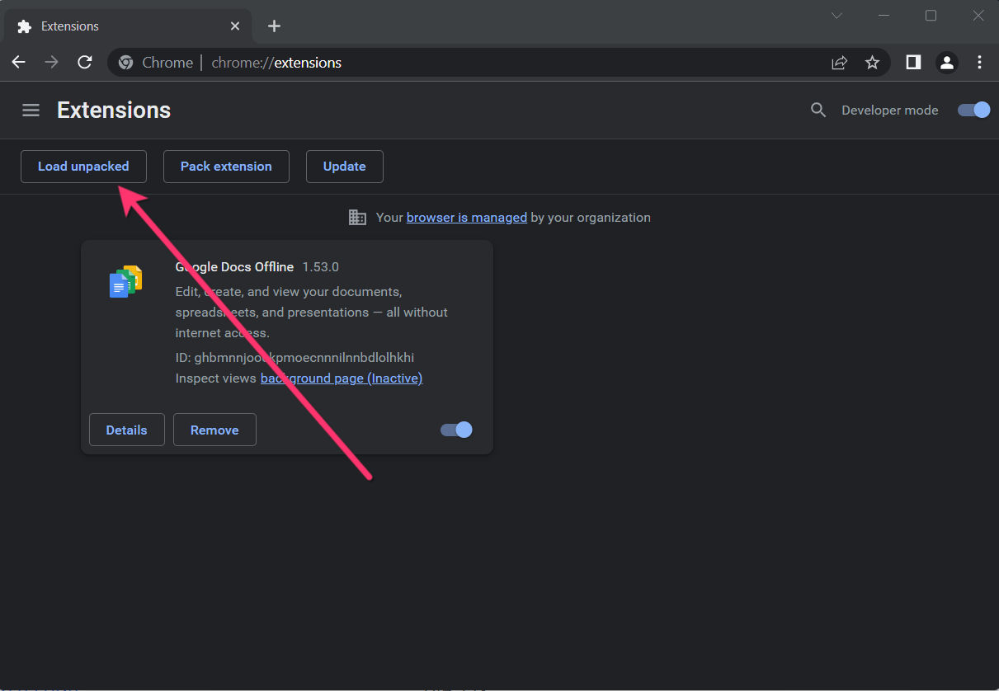

[English](./README.md) | [日本語](./README_ja.md) | [中文](./README_zh.md)

# Claude for Chrome (Research Preview) - Internal Unlock Version

This is an unlocked research preview of the **Claude for Chrome** extension. No Claude account or waitlist is required. Simply use your own API key to get instant access.

🛒&nbsp;&nbsp;<a href="https://hybrid44.gumroad.com/l/claude-for-chrome"><b>Purchase Now</b></a>
&nbsp;&nbsp;&nbsp;&nbsp;|&nbsp;&nbsp;&nbsp;&nbsp;
🚀&nbsp;&nbsp;<a href="./claude_1.0.25_0.zip"><b>Download</b></a>

  
  &nbsp;&nbsp;
  

## 🚀 Installation Guide

Follow these simple steps to install the extension.

1. ### Download and Unzip

    Download the .zip file and unzip it to a folder on your computer.

2. ### Open Chrome Extensions

    In your Chrome browser, navigate to the extensions page by entering `chrome://extensions` in the address bar.

3. ### Enable Developer mode.
    
4. ### Click on the Load Unpacked button
    
5. ### Select the directory of with the unpacked Zoom Chrome Extension ZIP file from step 1

## ⚙️ Getting Started

Once installed, you just need to add your API key:

1. Click the Claude for Chrome icon in your browser's toolbar.

2. Open the options page, switch to the "API configuration" tab.

3. Enter your Claude API key into the required field and click Save API Key.

4. You're all set! Enjoy using Claude directly in Chrome.
