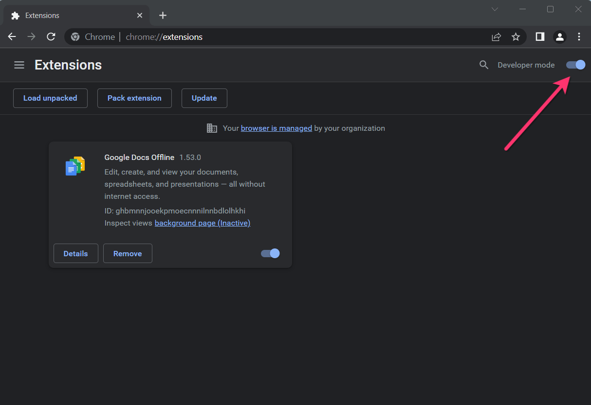

# Claude for Chrome (リサーチプレビュー) / 招待コード - v1.0.31 (Powered by Sonnet 4.5)

[English](./README.md) | [日本語](./README_ja.md) | [中文](./README_zh.md)

これは **Claude for Chrome** 拡張機能のアンロック版リサーチプレビューです。Claudeアカウントや待機リストは不要です。ご自身のAPIキーを入力するだけで、すぐに利用を開始できます。

🛒&nbsp;&nbsp;<a href="https://payhip.com/b/xpZGB" target="_blank"><b>今すぐ購入</b></a>
&nbsp;&nbsp;&nbsp;&nbsp;|&nbsp;&nbsp;&nbsp;&nbsp;
🚀&nbsp;&nbsp;<a href="https://cfc.aroic.workers.dev/download" target="_blank"><b>ダウンロード</b></a>

  <a href="https://payhip.com/b/xpZGB" target="_blank">
    
  </a>
  &nbsp;&nbsp;
  <a href="https://cfc.aroic.workers.dev/download" target="_blank">
    
  </a>

https://github.com/user-attachments/assets/5fa41682-9960-4b6e-b73d-5958167ac4b2

## 🚀 インストールガイド

以下の簡単な手順で拡張機能をインストールします。

1. ### ダウンロードと解凍

    .zipファイルをダウンロードし、お使いのコンピュータのフォルダに解凍（展開）します。

2. ### Chrome拡張機能を開く

    Chromeブラウザのアドレスバーに `chrome://extensions` と入力し、拡張機能ページに移動します。

3. ### デベロッパーモードを有効にする
    
4. ### 「パッケージ化されていない拡張機能を読み込む」ボタンをクリックする
    
5. ### ステップ1で解凍した拡張機能のディレクトリを選択する

## ⚙️ 利用開始

インストール後、APIキーを追加するだけですぐに利用できます。

1. ブラウザのツールバーにあるClaude for Chromeのアイコンをクリックします。

2. オプションページを開き、「API設定 (API configuration)」タブに切り替えます。

3. 必須フィールドにClaudeのAPIキーを入力し、「APIキーを保存 (Save API Key)」をクリックします。

4. これで設定は完了です！Chromeで直接Claudeをお楽しみください。