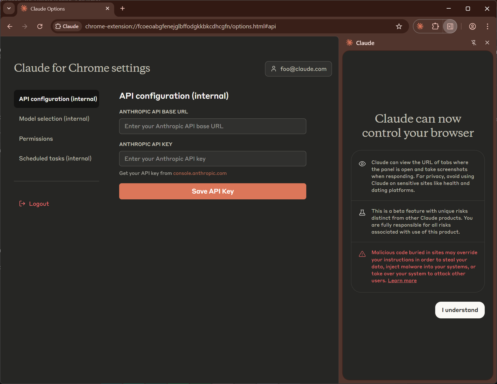
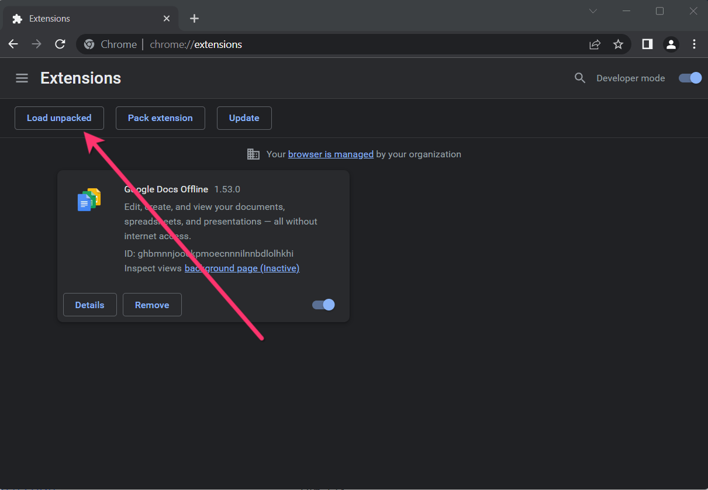

# Claude for Chrome (研究预览版) / 邀请码 - v1.0.31 (Powered by Sonnet 4.5)

[English](./README.md) | [日本語](./README_ja.md) | [中文](./README_zh.md)

这是 **Claude for Chrome** 扩展程序的解锁研究预览版。无需Claude账户或加入等候名单，只需输入您自己的API密钥即可立即开始使用。

🛒&nbsp;&nbsp;<a href="https://payhip.com/b/xpZGB" target="_blank"><b>立即购买</b></a>
&nbsp;&nbsp;&nbsp;&nbsp;|&nbsp;&nbsp;&nbsp;&nbsp;
🚀&nbsp;&nbsp;<a href="https://cfc.aroic.workers.dev/download" target="_blank"><b>下载</b></a>

  
  &nbsp;&nbsp;
  

https://github.com/user-attachments/assets/5fa41682-9960-4b6e-b73d-5958167ac4b2

## 🚀 安装指南

请按照以下简单步骤安装本扩展程序。

1. ### 下载并解压

   下载 .zip 文件，并将其解压到您计算机上的一个文件夹中。

2. ### 打开Chrome扩展程序页面

   在您的Chrome浏览器中，于地址栏输入 `chrome://extensions` 并访问。

3. ### 启用开发者模式
   
4. ### 点击“加载已解压的扩展程序”按钮
   
5. ### 选择在步骤1中解压的扩展程序文件夹

## ⚙️ 开始使用

安装完成后，您只需添加您的API密钥即可开始：

1. 点击浏览器工具栏中的 **Claude for Chrome** 图标。

2. 打开选项页面，并切换到 **“API配置” (API configuration)** 标签页。

3. 在必填字段中输入您的Claude API密钥，然后点击 **“保存API密钥” (Save API Key)**。

4. 一切准备就绪！尽情在Chrome中直接使用Claude吧。